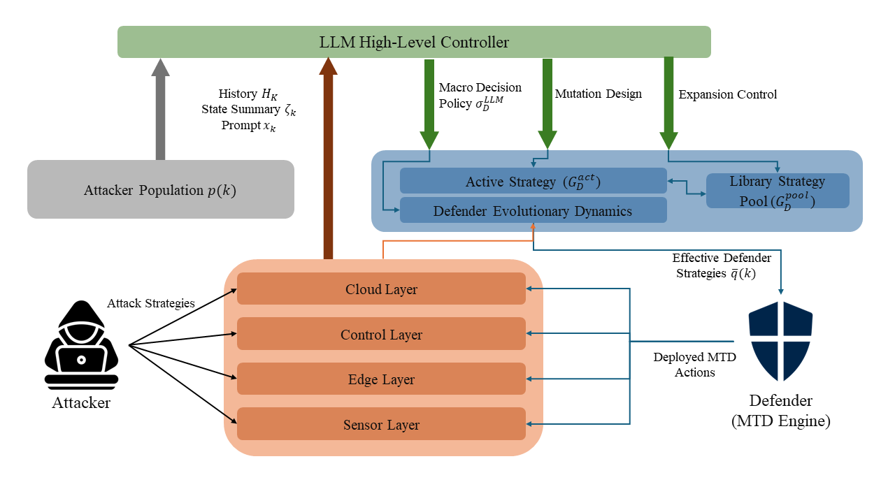

# LLM-MTD: Simulation, Emulation, and LLM Evaluation

This repository combines three related projects for evaluating moving target defense in edge-cloud systems:

- `LLM_MTD`: analytical/evolutionary simulation without Ryu, Mininet, or Containernet.
- `LLM_MTD_emo`: live edge-cloud emulation with Ryu, Containernet, game-based attacker/defender strategy selection, and a dashboard. This path does not require an LLM model.
- `LLM_MTD_eval`: LLM/Ollama evaluation layer that runs above `LLM_MTD_emo` and replaces the final defender choice with an LLM-based policy reasoner.



Expected repository layout after upload:

```text
.
├── LLM_MTD/
│   └── llm_mtd_sim/
├── LLM_MTD_emo/
└── LLM_MTD_eval/
```

## 1. LLM_MTD Simulation Only

Use this project when you want the analytical LLM-MTD evolutionary simulator without deploying Ryu, Mininet, Containernet, Docker service nodes, or the live emulator. This section is the fastest way to reproduce the abstract attacker-defender game and generate simulation/evaluation figures.

The simulator models an edge-cloud system under an attacker-defender evolutionary game. Each episode follows attack paths, computes SAL/SAP-style utilities, updates attacker and defender populations with replicator dynamics, and can optionally call local Ollama models for LLM-guided macro decisions and summaries.

Requirements:

- Python 3.9+; Python 3.10+ recommended
- Ollama only if you run LLM-enabled simulation methods

Install:

```bash
cd LLM_MTD/llm_mtd_sim
python3 -m venv .venv
source .venv/bin/activate
pip install -r requirements.txt
```

Optional Ollama setup for LLM-enabled simulator runs:

```bash
ollama serve
ollama pull llama3.2
ollama pull olmo-3:7b-think
```

Run one simulation:

```bash
python main.py --config config.yaml
```

Run batch evaluation:

```bash
python evaluate.py \
  --methods LLM-Full \
  --num_scenarios 3 \
  --num_trials 5 \
  --horizon 40 \
  --output_dir results_eval \
  --seed 42
```

Important outputs:

```text
LLM_MTD/llm_mtd_sim/results/sim_log.csv
LLM_MTD/llm_mtd_sim/results/episode_summaries.jsonl
LLM_MTD/llm_mtd_sim/results/figs/*.png
LLM_MTD/llm_mtd_sim/results/figs/data_*.csv
LLM_MTD/llm_mtd_sim/results_eval/summary.csv
LLM_MTD/llm_mtd_sim/results_eval/summary_by_scenario.csv
LLM_MTD/llm_mtd_sim/results_eval/figures/*.png
LLM_MTD/llm_mtd_sim/results_eval/fig_data/*.csv
```

Useful `config.yaml` areas:

- `simulation`: seeds, episode count, steps per episode, `z_max`, and discounting.
- `evolutionary`: defender learning and LLM weighting.
- `attacker`: attacker learning and bounded-rationality controls.
- `active_pool`: strategy promotion and demotion rules.
- `llm`: Ollama host, macro model, summary model, and timeout.
- `costs`: SAL/SAP and control-cost weights.

Example episode-count change:

```yaml
simulation:
  episodes: 500
```

## 2. LLM_MTD_emo Live Emulator, Game, and Dashboard

Use this project when you want the live edge-cloud emulation, Ryu controller actions, repeated-game attacker/defender strategy loop, and browser dashboard without any LLM model. This is the baseline live system: the strategy layer selects both attacker and defender from the evolutionary game model.

Main runtime loops:

```text
Telemetry path:
sensor-node -> edge-gateway -> edge-worker -> cloud-db

Monitoring path:
services -> cloud-metrics / cloud-logger -> dashboard_server.py -> Dashboard.html

Defense path:
strategy_runtime.py -> cloud_policy -> Ryu controller -> OpenFlow rules
```

Requirements:

- Python 3
- Docker
- Ryu
- Mininet/Containernet environment
- Local Docker images built from `LLM_MTD_emo/images/*`

Build service images:

```bash
cd LLM_MTD_emo
bash scripts/build_images.sh
```

Start the Ryu controller in one terminal:

```bash
cd LLM_MTD_emo
ryu-manager --observe-links controller_app.py
```

Start the Containernet topology in another terminal:

```bash
cd LLM_MTD_emo
sudo python3 topology.py
```

If topology startup fails part-way, clean Mininet state and retry:

```bash
sudo mn -c
sudo python3 topology.py
```

Start the dashboard proxy:

```bash
cd LLM_MTD_emo
python3 dashboard_server.py
```

Open the dashboard:

```text
http://<ubuntu-vm-ip>:8088/Dashboard.html
```

If the host cannot reach the service network, run the dashboard proxy with Docker access:

```bash
cd LLM_MTD_emo
sudo -E python3 dashboard_server.py
```

Useful controller checks:

```bash
curl http://127.0.0.1:8080/mtd/status
curl http://127.0.0.1:8080/mtd/metrics
```

Example direct Ryu action:

```bash
curl -X POST http://127.0.0.1:8080/mtd/action \
  -H 'Content-Type: application/json' \
  -d '{"action":"quarantine_sensor","target":"sen4"}'
```

Release a target:

```bash
curl -X POST http://127.0.0.1:8080/mtd/action \
  -H 'Content-Type: application/json' \
  -d '{"action":"release_sensor","target":"sen4"}'
```

Run one offline game stage without touching Caldera or Ryu:

```bash
cd LLM_MTD_emo
python3 integrations/strategy/strategy_runtime.py \
  --offline \
  --scenario-id sen4_edge2_clouddb \
  --no-save-population \
  --no-stage-log
```

Run one live baseline game stage against the emulator:

```bash
cd LLM_MTD_emo
python3 integrations/strategy/strategy_runtime.py \
  --scenario-id sen4_edge2_clouddb \
  --execute-defender \
  --observe-delay-seconds 45
```

If you want the attacker to dispatch through Caldera, start the Caldera dispatch bridge:

```bash
cd LLM_MTD_emo
CALDERA_API_KEY=<red_api_key> \
python3 integrations/caldera/caldera_dispatch_bridge.py \
  --logger-url "http://127.0.0.1:${LOGGER_PORT}/attack/event" \
  --policy-url "http://127.0.0.1:${POLICY_PORT}/context"
```

Then run the baseline game with attacker execution:

```bash
cd LLM_MTD_emo
python3 integrations/strategy/strategy_runtime.py \
  --scenario-id sen4_edge2_clouddb \
  --core-url "http://127.0.0.1:${CORE_PORT}/core" \
  --cloud-policy-url "http://127.0.0.1:${POLICY_PORT}/context" \
  --cloud-logger-url "http://127.0.0.1:${LOGGER_PORT}/attack/event" \
  --execute-attacker \
  --attacker-dispatch-url "http://127.0.0.1:9000/caldera/dispatch" \
  --execute-defender \
  --observe-delay-seconds 45
```

Strategy outputs:

```text
LLM_MTD_emo/integrations/strategy/population_state.json
LLM_MTD_emo/integrations/strategy/stage_history.jsonl
LLM_MTD_emo/integrations/strategy/decision_trace.jsonl
```

Dashboard inputs:

```text
http://127.0.0.1:8088/core
http://127.0.0.1:8088/experiment/summary
http://127.0.0.1:8088/mtd/status
http://127.0.0.1:8088/mtd/metrics
```

## 3. LLM_MTD_eval With LLM and Ollama

Use this project when you want to evaluate an LLM defender on top of the live emulator. The attacker/game side remains aligned with `LLM_MTD_emo`; the LLM is used as the final defender policy reasoner over the active defender candidates.

This layer:

- reads live emulator state from `/core`, `/experiment/summary`, `/mtd/status`, and `/mtd/metrics`
- loads scenarios and MulVAL context from `LLM_MTD_emo`
- keeps the repeated-game attacker and population update structure
- asks an Ollama model to rank active defender candidates
- maps the selected defender strategy into a real Ryu action when execution is enabled
- writes stage history, decision traces, stage summaries, population state, CSV tables, figures, and figure-data CSV files

Requirements:

- Python 3.11+
- `LLM_MTD_emo` running for live stages
- Ollama reachable from the evaluator machine

Install:

```bash
cd LLM_MTD_eval
python -m pip install -r requirements.txt
python -m pip install -e .
python -m pytest llm_mtd_eval/tests
```

Current Ollama config is in:

```text
LLM_MTD_eval/configs/models/llm_only.yaml
```

The current model entry is:

```yaml
llm:
  provider: ollama
  model_name: gemma4:e4b
  base_url: http://192.168.0.197:11434
```

Check that Ollama is reachable and that the model exists:

```bash
curl http://192.168.0.197:11434/api/tags
ollama pull gemma4:e4b
```

Safe offline evaluator smoke test:

```bash
cd LLM_MTD_eval
llm-mtd-eval run-trial \
  --model-config configs/models/llm_only.yaml \
  --scenario-id sen4_edge2_clouddb \
  --offline \
  --dry-run
```

Run one live LLM defender stage:

```bash
cd LLM_MTD_eval
llm-mtd-eval run-stage \
  --model-config configs/models/llm_only.yaml \
  --scenario-id sen4_edge2_clouddb \
  --core-url "http://127.0.0.1:${CORE_PORT}/core" \
  --mtd-status-url "http://127.0.0.1:8080/mtd/status" \
  --mtd-metrics-url "http://127.0.0.1:8080/mtd/metrics" \
  --cloud-policy-url "http://127.0.0.1:${POLICY_PORT}/context" \
  --cloud-logger-url "http://127.0.0.1:${LOGGER_PORT}/attack/event" \
  --execute-attacker \
  --attacker-dispatch-url "http://127.0.0.1:9000/caldera/dispatch" \
  --execute-defender \
  --observe-delay-seconds 45 \
  --llm-timeout-seconds 180 \
  --llm-max-retries 1 \
  --llm-compact-prompt \
  --llm-max-candidate-fields 9
```

Live evaluator outputs:

```text
LLM_MTD_eval/outputs/raw/live_stage_history.jsonl
LLM_MTD_eval/outputs/raw/live_decision_trace.jsonl
LLM_MTD_eval/outputs/raw/stage_summaries.jsonl
LLM_MTD_eval/outputs/raw/live_population_state.json
LLM_MTD_eval/outputs/traces/*_defender_trace.json
LLM_MTD_eval/outputs/traces/*_summary_trace.json
```

Point the emulator dashboard at evaluator logs:

```bash
DASHBOARD_DECISION_TRACE_FILE=/home/reza/LLM_MTD_eval/outputs/raw/live_decision_trace.jsonl \
DASHBOARD_STAGE_HISTORY_FILE=/home/reza/LLM_MTD_eval/outputs/raw/live_stage_history.jsonl \
python3 /home/reza/LLM_MTD_emo/dashboard_server.py
```

Build paper/report outputs comparing baseline game and LLM defender:

```bash
cd LLM_MTD_eval
llm-mtd-eval build-report \
  --eval-stage-history outputs/raw/live_stage_history.jsonl \
  --eval-decision-trace outputs/raw/live_decision_trace.jsonl \
  --eval-stage-summaries outputs/raw/stage_summaries.jsonl \
  --eval-population outputs/raw/live_population_state.json \
  --baseline-stage-history /home/reza/LLM_MTD_emo/integrations/strategy/stage_history.jsonl \
  --baseline-decision-trace /home/reza/LLM_MTD_emo/integrations/strategy/decision_trace.jsonl \
  --baseline-population /home/reza/LLM_MTD_emo/integrations/strategy/population_state.json \
  --output-dir outputs/reports \
  --paper-mode
```

Report outputs:

```text
LLM_MTD_eval/outputs/reports/tables/*.csv
LLM_MTD_eval/outputs/reports/figures/*.png
LLM_MTD_eval/outputs/reports/figures/*.csv
LLM_MTD_eval/outputs/reports/summary/report_manifest.json
LLM_MTD_eval/outputs/reports/summary/reporting_guide.md
```

By default, report summaries exclude debug-only LLM stages. To include fallback, timeout, or non-paper-valid stages in the report build:

```bash
llm-mtd-eval build-report ... --include-debug-stages
```

Recommended workflow:

1. Run `LLM_MTD_emo` first to start Ryu, the topology, service metrics, and the dashboard.
2. Run baseline stages with `LLM_MTD_emo/integrations/strategy/strategy_runtime.py`.
3. Run LLM stages with `LLM_MTD_eval` and Ollama.
4. Build reports from both baseline and LLM outputs.
